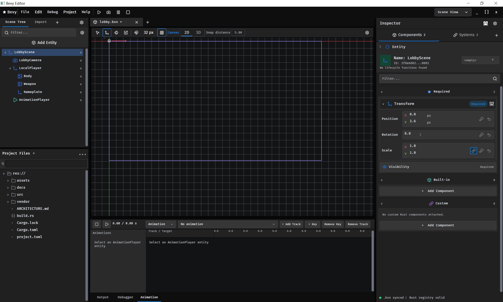

# Revy

> [!CAUTION]
> **项目开发声明**
>
> 目前，项目的大部分代码由 AI 辅助完成。接下来，我会适当放缓功能开发，
> 将重心转向代码审查、重构与质量优化，直到我们真正理解并能够完全掌控整个系统。
> 这个过程或许漫长，也需要更多耐心。
>
> Revy 的目标并不只是成为一款游戏引擎。我希望它未来能够进一步对接嵌入式设备
> 与机器人仿真系统，逐步发展为一个开放、可靠且通用的实时交互与仿真平台。



Revy is an independent open-source engine workspace derived from Bevy **0.19**, with a
Godot-inspired desktop editor and a separate game project. The inherited Bevy
foundation and the custom engine now share one engine source workspace.

适配最新 Bevy 的开源编辑器，以此过渡到 Bevy 官方版本编辑器。或许我们可以做得
更好，例如进一步支持 Robot 仿真等应用场景。

Repository: https://github.com/Gin-Grey/Revy-Bevy

## Workspace architecture

```text
engine/                   Engine source workspace
  Cargo.toml              Bevy-derived workspace and foundation package
  crates/
    arisna_engine/         Runtime contract package (legacy path retained for compatibility)
    bevy_*/                Inherited Bevy 0.19 foundation modules
editor/                   Desktop editor application
  src/ui/                 Editor shell, theme, and widgets
project/                  Default source project mounted as res://
  src/                    Rust game source
  assets/                 Game assets mounted by Bevy's AssetServer
    scenes/               Saved scenes
assets/                   Internal editor icons and UI assets
docs/                     Architecture and implementation plans
build/                    Development and distribution support
  scripts/                Release and project-creation scripts
  templates/              Starter project templates
  packaging/              SDK metadata and release documentation
  vendor/cargo/           Vendored crates.io dependencies for offline builds
target/                   All generated builds, caches, and packages
```

Both applications depend on the custom engine, which owns the Bevy dependency:

```text
revy_editor -> revy_engine alias -> arisna_engine package -> Bevy-derived foundation
revy_game   -> revy_engine alias -> arisna_engine package -> Bevy-derived foundation
```

The engine workspace lives under `engine/` in the unified repository. Bevy
0.19 is the inherited foundation rather than an upgrade-tracking third-party
dependency. The `arisna_engine` package name and `.arisna` project-state path
remain temporarily supported so existing projects continue to open after the
Revy rename. New projects use the `revy_engine` dependency alias.

## Current editor

- BSN-authored menu bar, main toolbar, document tabs, viewport toolbar, dock panels, and status bar
- Feathers controls with Lucide icons and keyboard-focus behavior
- Left-side Scene/FileSystem stack, center Viewport/Output stack, and right-side Inspector panel
- Independently resizable dock widths and lower-panel heights
- FileSystem dock mounted to the open game project as `res://`
- Independent 2D/3D workspaces with remembered selection and active camera
- 2D canvas grid, axes, and sprite selection bounds
- 3D perspective grid and mode-isolated transform gizmo
- Viewport-scoped 3D fly, orbit, pan, zoom, and selection focus controls
- Cursor-anchored 2D pan and zoom with an adaptive canvas grid
- Translate / rotate / scale gizmo buttons and keyboard shortcuts
- Live hierarchy, inspector values, filesystem refresh, import, and context menu

## Editor UI architecture

```text
editor/src/ui/
  mod.rs         Plugin wiring, runtime panel mounting, interaction observers
  components.rs  Host markers and small UI resources
  shell.rs       Stable editor hierarchy written with bsn!
  theme.rs       Colors, dimensions, and visual design tokens
  widgets.rs     Reusable BSN buttons, tabs, labels, and search fields
```

The shell owns only stable layout. Panels that rebuild their children at
runtime stay in their domain modules and mount into explicit BSN host nodes:

- `hierarchy.rs` owns the Scene hierarchy rows.
- `inspector.rs` owns selection details and transform editing.
- `filesystem.rs` owns FileSystem scanning and commands.
- `panels.rs` owns dock resize state and pointer-drag behavior.
- `viewport.rs` owns cameras, viewport synchronization, scene content, and gizmos.
- `viewport/navigation.rs` owns input capture and independent 2D/3D camera state.

This separation is intentional: adding a material editor, scene tabs, or a
Blueprint-like graph should not require turning `shell.rs` into a stateful
monolith.

## Planning docs

- [中文架构说明](docs/ARCHITECTURE.zh-CN.md) - 当前真实目录、进程、场景、ECS、资源路径与人工审核规则
- [GitHub 上传与更新流程](docs/REPOSITORY_WORKFLOW.zh-CN.md) - `origin`/`upstream`、分支、版本和发布约定
- [Engine roadmap](docs/ENGINE_ROADMAP.md) - current-state assessment and the staged plan toward a production-focused custom engine
- [Editor MVP plan](docs/EDITOR_MVP_PLAN.md) - interface-first architecture, backlog, acceptance criteria, and a 17-21 week implementation sequence

## Run

```powershell
cd Revy-Bevy
cargo run
```

The workspace defaults to `revy_editor`, so `cargo run` opens the project
manager. From there you can create a project, import an existing project, or
open a recent project without using PowerShell. The project manager remembers
the last opened project and keeps recent-project records under the current
user's local application data directory.

Run the standalone editor for a specific project by passing its root directory
either positionally or with `--project`:

```powershell
cargo run -p revy_editor -- E:\Games\Demo
cargo run -p revy_editor -- --project E:\Games\Demo
revy_editor.exe E:\Games\Demo
revy_editor.exe --project E:\Games\Demo
```

Run the standalone game entry point with:

```powershell
cargo run -p revy_game
```

The first compile may take a long time.

The FileSystem dock exposes the selected game project as `res://`. Its browse,
drop-import, create, terminal, and file-manager actions stay within that root.
Hidden entries, `target/`, `node_modules/`, and symbolic links are omitted.
The editor's own icons and UI assets remain in the repository `assets/`
directory and are not shown under `res://`.

Debug builds load those internal editor assets with Bevy's `file_watcher`
feature. On desktop, the renderer selects DX12 with a DirectComposition swap
chain on Windows, Metal on macOS, and Vulkan on Linux.

## Release package

Build a distributable Windows editor, SDK, starter project, templates, and
license bundle with:

```powershell
powershell.exe -NoProfile -ExecutionPolicy Bypass -File .\build\scripts\package_release.ps1 -Configuration Release
```

The package is written to `target/package/Revy`. Its editor is a compiled Release
executable. The unified engine source is stored under `sdk/source/engine` only
as a Cargo build input and is not shown under a game's `res://`.

The Release project manager creates projects that reference the installed SDK
without exposing engine files in the project tree. The bundled
`new_project.ps1` remains available for automation and unattended setup, but
is not required for the normal workflow. The SDK requires Rust 1.97 or newer;
Release builds record the compiler version used by the build. Locked crates.io
dependencies are vendored into the SDK so generated projects build without
downloading crates.

## License

Revy-authored source code is released under the [MIT License](LICENSE). The
complete editor, runtime, Bevy-derived foundation, project templates, and
offline dependency sources are kept in this repository; generated build and
editor-cache directories are excluded.

The inherited Bevy source remains available under its upstream MIT or
Apache-2.0 terms, and vendored third-party packages retain their own license
files. No proprietary component is required to build Revy.

## Controls

| Input | Action |
|-------|--------|
| Left click mesh | Select |
| Drag gizmo | Move / rotate / scale |
| Hold right mouse + move | Look around the 3D viewport |
| Right mouse + `WASD` / `Q` / `E` | Fly through the 3D scene |
| Right mouse + `Shift` | Fly faster |
| `Alt` + left drag | Orbit the 3D selection pivot |
| Middle drag | Pan the active 2D/3D viewport |
| `Space` + left drag | Pan the 2D canvas |
| Mouse wheel | 3D dolly / 2D cursor-anchored zoom |
| `F` while pointer is over viewport | Focus the selected object |
| `1` / `2` / `3` | Translate / Rotate / Scale |
| `X` | Toggle World / Local space |
| Hierarchy row | Select object |
| Inspector `-` / `+` | Nudge transform values |
| `2D` / `3D` tabs | Switch workspace and active camera |
| Drag a vertical divider | Resize the Scene or Inspector dock |
| Drag above FileSystem / Output | Resize that lower dock panel |

## Current focus

Viewport navigation v1 is complete. The next editor milestone is a shared
Undo/Redo command history for gizmo drags, Inspector edits, and entity actions,
followed by scene persistence from [the engine roadmap](docs/ENGINE_ROADMAP.md).
