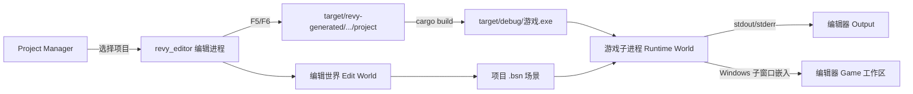
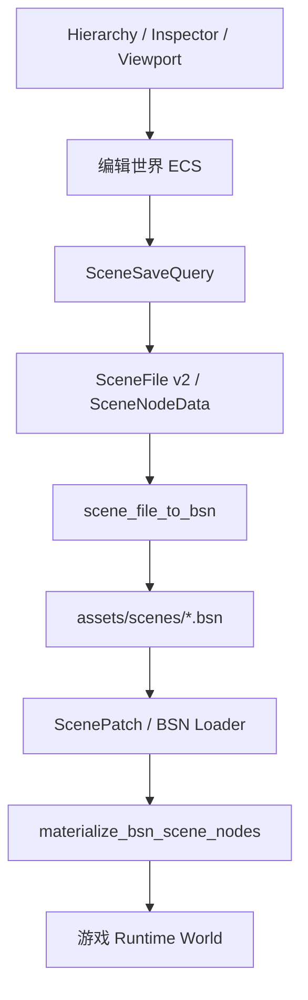

# Revy 引擎项目架构说明

本文描述当前 Revy 仓库的真实实现，用于人工审核、功能扩展和问题定位。文档以代码为准；修改模块边界、场景格式或编辑器运行流程时，应同步更新本文。

## 1. 架构目标

Revy 以 Bevy 0.19 为底层，向上提供可视化编辑器、可持久化场景和独立游戏项目。当前架构遵守以下原则：

1. 编辑器和游戏共享 `arisna_engine` 的项目、场景及运行时契约。
2. 编辑状态与运行状态隔离：编辑器持有编辑世界，游戏在独立子进程中运行。
3. `.bsn` 是场景事实来源；Scene、Viewport、Inspector 都只是同一份编辑世界的不同视图。
4. Rust 脚本仍然编译为原生代码，不在编辑器中解释执行。
5. ECS 实体编号不写入场景；跨会话引用使用稳定的 `SceneNodeId`。
6. 项目资源必须受 `ProjectRoot` 约束，不能通过 `..`、绝对路径或链接逃出项目根目录。
7. 构建缓存、生成项目、临时文件和可执行文件统一写入仓库的 `target/`。

## 2. 仓库目录

```text
Revy-Bevy/
├─ Cargo.toml                         外层产品工作区
├─ editor/                            桌面编辑器 revy_editor
│  ├─ build.rs                        内置编辑器资源的构建支持
│  └─ src/                            编辑器功能模块
├─ engine/                            基于 Bevy 0.19 的底层引擎工作区
│  ├─ Cargo.toml                      Bevy 派生工作区和 bevy 包
│  └─ crates/
│     ├─ arisna_engine/               Revy 运行时契约（保留旧目录名兼容项目）
│     └─ bevy_*/                      Bevy 0.19 底层模块
├─ project/                           仓库内默认游戏项目/回归样例
├─ assets/                            编辑器自身图标和界面资源
├─ build/
│  ├─ templates/rust_game/            新建 Rust 游戏项目模板
│  ├─ scripts/                        构建和打包脚本
│  └─ vendor/cargo/                   离线依赖源
├─ docs/                              架构、路线图和审核文档
└─ target/                            所有生成物，禁止提交
```

`assets/` 和游戏项目中的 `assets/` 不是同一个目录：

- 根目录 `assets/` 只服务编辑器自身。
- `<game>/assets/` 是用户项目资源，对应编辑器中的 `res://assets/...`。
- 游戏运行时把 `<game>/assets/` 直接设为 Bevy `AssetServer` 根目录，因此运行时句柄通常使用去掉 `assets/` 前缀后的路径。

## 3. Cargo 工作区边界

仓库存在两套有意分离的 Cargo 工作区。

### 3.1 外层产品工作区

根目录 `Cargo.toml` 包含：

| 成员 | 作用 |
| --- | --- |
| `editor` | 可视化编辑器可执行文件 |
| `engine/crates/arisna_engine` | 编辑器和游戏共用的公开引擎层 |
| `project` | 默认游戏项目和运行回归样例 |

默认成员是 `editor`。依赖方向为：

```text
revy_editor ───┐
               ├─> arisna_engine ─> Bevy 0.19 派生底层
game project ──┘
```

### 3.2 `engine/` 底层工作区

`engine/` 是 Bevy 0.19 派生源码的独立工作区。外层工作区通过路径依赖使用它，但不会把全部 `bevy_*` crate 当作外层成员重复管理。

审核规则：

- 普通编辑器功能优先修改 `editor/`。
- 项目格式、场景格式和游戏运行时契约修改 `arisna_engine`。
- 只有平台、渲染、资产加载或 Bevy 本身的问题才修改 `engine/crates/bevy_*`。
- 修改 Bevy 派生底层时必须记录原因和影响范围，避免无边界分叉。

## 4. 进程架构



### 4.1 编辑器启动

`editor/src/main.rs` 负责唯一的启动分流：

1. 没有项目参数时，只启动 Project Manager。
2. 指定项目目录后，先注册 `EnginePlugin`，再注册 `EditorPlugin`。
3. `EnginePlugin` 提供共享类型注册、`ProjectRoot` 和平台配置。
4. `EditorPlugin` 组合 UI、Scene、Inspector、Viewport、Undo、运行器等编辑器插件。

### 4.2 编辑器内运行

`editor/src/play.rs` 不会直接修改并编译用户项目副本，流程如下：

1. 运行前保存脏场景；未命名场景必须先完成 Save As。
2. 校验目标场景位于 `ProjectRoot` 内并且能被解析。
3. 把 `src/`、`vendor/`、`.cargo/` 和项目清单同步到 `target/revy-generated/<项目哈希>/project/`。
4. 资源目录使用受控目录链接，生成副本仍引用真实项目资源。
5. 扫描 Inspector 中绑定的 Entity Script 和 System，只向生成副本注入所需的 Rust 注册代码。
6. 使用 `CARGO_TARGET_DIR=<Revy>/target` 构建调试游戏。
7. 以 `--scene`、`--control` 启动游戏子进程，并通过 `REVY_PROJECT_ROOT` 告诉运行时真实项目根目录；旧 `ARISNA_PROJECT_ROOT` 仍兼容。
8. Windows 下把游戏窗口嵌入编辑器 Game 工作区；日志通过管道进入 Output 面板。

这不是网络通信，也不是脚本解释器。游戏逻辑仍在游戏进程中作为编译后的 Rust 系统运行；编辑器只负责构建、启动、窗口嵌入和控制文件。

### 4.3 生成物位置

```text
target/
├─ debug/                              编辑器和游戏调试可执行文件
├─ revy-generated/<hash>/project/      编辑器运行用生成项目
├─ cargo-home/                         子进程 Cargo 缓存
├─ editor-temp/                        子进程临时目录
├─ editor-data/                        子进程 APPDATA/LOCALAPPDATA
└─ package/                            可选打包产物
```

不得恢复仓库根目录的 `release/`，也不得把项目构建缓存写到用户项目或 C 盘。

## 5. 编辑器内部结构

`EditorPlugin` 是组合根，各模块通过 Bevy Plugin、Resource、Component、Message 和 Observer 协作。

| 模块 | 所有权和职责 |
| --- | --- |
| `editor_menu.rs` | 顶部菜单状态与动作 |
| `entities.rs` | 实体预设、编辑器组件和实体创建 |
| `entity_picker.rs` | Add Entity 可拖动面板及实体类型选择 |
| `filesystem.rs` | `res://` 文件树、导入、创建和外部编辑器打开 |
| `hierarchy.rs` | Scene Tree、稳定 ID、父子级、拖放和根节点 |
| `inspector.rs` | 组件/系统显示、字段编辑、脚本绑定和资源拖放 |
| `scene.rs` | `SceneDocument`、打开、保存、Save As 和 `.bsn` 转换 |
| `selection.rs` | 单选、多选和主选择实体 |
| `undo.rs` | 场景快照、Undo/Redo 和 dirty 状态 |
| `workspace.rs` | 2D/3D/Game 工作区及各工作区选择状态 |
| `viewport.rs` | 编辑相机、预览同步、Viewport 与 Gizmo 组合 |
| `viewport/*` | 导航、框选、输入所有权、吸附、Sprite/UI 编辑 |
| `rust_components.rs` | 扫描项目 Rust 组件、系统和生命周期函数 |
| `play.rs` | 保存、生成、构建、启动、暂停、停止和窗口嵌入 |
| `output.rs` | 编辑器与子进程日志缓冲及显示 |
| `panels.rs` | Dock 尺寸和分隔线拖动 |
| `project_settings.rs` | `project.toml` 基础设置 |
| `project_manager/` | 新建、导入、最近项目和启动编辑器 |
| `ui/shell.rs` | 稳定的 BSN 界面骨架 |
| `ui/mod.rs` | UI 插件注册、动态面板挂载和公共交互 |
| `ui/components.rs` | UI Host/Marker 组件 |
| `ui/widgets.rs` | 可复用 BSN 控件 |
| `ui/theme.rs` | 颜色、尺寸和视觉 token |

### 5.1 UI 架构约束

`ui/shell.rs` 只声明稳定外壳。需要根据场景或文件动态重建的内容由业务模块持有，并挂载到明确的 Host：

```text
BSN Shell Host
    ├─ hierarchy.rs 生成 Scene 行
    ├─ filesystem.rs 生成文件行
    └─ inspector.rs 生成属性控件
```

因此，新增行为应进入对应业务模块；不要把文件扫描、场景编辑或 Inspector 状态塞进 `shell.rs`。

## 6. 场景与 ECS 数据流



### 6.1 编辑状态

`SceneDocument` 只保存文档级状态：是否打开、是否修改、路径、名称和保存对话框。实体真实数据位于编辑器 Bevy World 中。

每个可编辑实体至少具有：

- `EditableObject`：编辑器显示名称等信息。
- `SceneNodeId`：可持久化稳定 ID。
- `SceneParentId`：稳定父节点引用。
- `SceneSiblingOrder`：同级顺序。
- `SceneSpace`：2D 或 3D 工作区。
- 对应预设、Transform、UI、Sprite、模型、碰撞或脚本数据。

不要把 Bevy `Entity` 写入磁盘。它只在当前 World 生命周期内有效。

### 6.2 保存

保存时 `SceneSaveQuery` 从编辑世界读取所有可编辑实体，生成 `SceneFile v2`，再通过共享的 `scene_file_to_bsn` 输出 `.bsn`。

保存使用“同目录临时文件 + 原子替换”：只有完整内容写入成功后才替换旧场景，失败时保留原文件。

### 6.3 运行时加载

`SceneRuntimePlugin` 在 Startup 阶段校验并加载目标场景。对于 `.bsn`：

1. BSN Loader 生成反射组件和层级。
2. `materialize_bsn_scene_nodes` 把编辑器预设补成真正的运行时 Sprite、UI、Camera、Light、Mesh 和模型实例。
3. `materialize_reflected_custom_components` 在类型已注册时实例化项目自定义组件。
4. Entity Script 和 System 绑定进入各自运行时调度器。
5. 场景文件改变时，运行时可执行 BSN 热重载。

编辑器保存和游戏加载必须共用 `arisna_engine::scene` 中的转换函数，禁止各写一套不兼容解析器。

## 7. Rust 组件、Entity Script 与 System

### 7.1 Built-in Component

Built-in Component 是引擎已知组件，例如 Transform、Visibility、Sprite、Camera 和 Light。Inspector 可以直接编辑，运行时按预设或组件名物化。

### 7.2 Custom Component

Custom Component 来自游戏项目 `src/` 中的 `#[derive(Component)]` 类型。场景保存：

- 完整 Rust 类型路径。
- `res://src/...` 源文件路径。
- Inspector 可编辑字段值。

运行时若游戏注册了该反射类型，就创建真实组件；否则仍保留 `RuntimeCustomComponents` 元数据并报告可诊断状态，不能静默丢失数据。

### 7.3 Entity Script

Entity Script 表示“某个实体拥有一组生命周期回调”。回调接收 `In<Entity>`，可使用普通 Bevy System 参数。当前生命周期为：

- `Start`
- `Update`
- `FixedUpdate`
- `PostUpdate`

`Start` 对每个实体、每个具体函数只执行一次。

### 7.4 System

System 不唯一属于某个组件，也不等同于 Entity Script。场景保存稳定函数路径、调度阶段、启用状态和 `before/after` 顺序约束；实际 Rust 函数由游戏构建时注册。

审核重点：

- 场景只保存稳定路径，不保存函数指针或 `SystemId`。
- 生成项目只注册当前场景真实绑定的系统。
- 找不到注册函数时必须输出错误，不能假装执行成功。
- `Startup` 绑定只运行一次；其他阶段按 Bevy Schedule 执行。

## 8. 项目与资源路径

`ProjectRoot` 是所有项目 IO 的边界。建议业务层始终传项目相对路径或 `res://` 路径，在真正读写前统一解析。

| 路径形式 | 用途 |
| --- | --- |
| `res://assets/scenes/lobby.bsn` | 编辑器展示和场景元数据中的项目资源路径 |
| `assets/scenes/lobby.bsn` | 相对 `ProjectRoot` 的磁盘路径 |
| `scenes/lobby.bsn` | 游戏 AssetServer 根为 `<project>/assets` 时的资产句柄 |
| `project://...` | 编辑器为项目资产注册的 Bevy AssetSource |

路径审核规则：

1. 拒绝绝对路径、父级跳转和空路径段。
2. 读取现有文件时进行规范化并确认仍位于项目根内。
3. 编辑器内部图标不应出现在项目 FileSystem 面板。
4. 外部拖入文件先复制到项目，再生成 `res://` 引用。
5. 链接目录需要单独处理，不能因为规范化后的真实路径不同就误判合法运行时资源。

## 9. 常见扩展位置

### 新增实体类型

1. 在 `entities.rs` 定义类型、默认组件和图标。
2. 在 `entity_picker.rs` 加入分组、搜索和说明。
3. 在 `hierarchy.rs` 接入创建与父子级规则。
4. 在 `inspector.rs` 增加对应编辑控件。
5. 在编辑器 `scene.rs` 和运行时 `arisna_engine/scene.rs` 完成保存/加载映射。
6. 添加 round-trip 和运行时物化测试。

### 新增 Inspector 组件

1. 明确属于 Required、Built-in 还是 Custom。
2. 定义默认值、重置、移除和只读规则。
3. 所有连续编辑在一次拖动结束时形成一条 Undo 记录。
4. 同时验证 Scene、Viewport、保存重开和运行游戏四个结果。

### 新增面板

1. 在业务模块定义状态和行为。
2. 在 `ui/shell.rs` 只放稳定 Host 和布局。
3. 通过 `EditorUiPlugin` 挂载动态内容。
4. 长内容必须接入公共滚动组件。
5. 不允许面板直接持有另一面板的内部 UI Entity。

### 新增资源类型

1. 定义允许扩展名和 `res://` 规范化函数。
2. FileSystem 负责导入和选择。
3. Inspector 负责引用字段和拖放。
4. Editor Viewport 与 Runtime 分别验证显示，但共用同一资源路径契约。

## 10. 测试与构建

为避免向 C 盘写入 Cargo 和临时数据，PowerShell 中使用：

```powershell
$env:CARGO_HOME='<workspace>\target\cargo-home'
$env:CARGO_TARGET_DIR='<workspace>\target'
$env:TEMP='<workspace>\target\editor-temp'
$env:TMP='<workspace>\target\editor-temp'
```

常用命令：

```powershell
cargo check -p revy_editor --offline -j 1
cargo test -p revy_editor --offline -j 1
cargo test -p arisna_engine --offline -j 1
cargo build -p revy_editor --offline -j 1
```

验证优先级：

1. 纯函数和格式转换使用单元测试。
2. 场景必须测试保存/加载 round-trip、稳定 ID 和非法层级。
3. 编辑器交互需要测试状态变化、Undo/Redo 和输入所有权。
4. UI 修改需要实际打开编辑器检查常见分辨率、滚动和拖动。
5. 运行时修改必须通过“编辑器打开场景 -> 保存 -> 编辑器内运行”验收。

## 11. 人工审核清单

提交前至少确认：

- [ ] 修改位于正确模块，没有把业务状态塞进 `ui/shell.rs`。
- [ ] 项目文件读写经过 `ProjectRoot` 边界检查。
- [ ] 没有把 Bevy `Entity`、临时路径或函数指针序列化。
- [ ] `.bsn` 保存和运行时加载仍然互相兼容。
- [ ] 新组件支持默认值、重置、必要时支持移除。
- [ ] 编辑操作可撤销，连续拖动不会产生大量历史记录。
- [ ] 编辑器和游戏显示结果一致。
- [ ] 所有生成物都在 `target/`，没有创建根目录 `release/`。
- [ ] 没有覆盖无关的用户改动。
- [ ] 测试结果和未验证风险已记录。

## 12. 当前已知边界

- 编辑器当前以单个活动 `SceneDocument` 为主，场景标签尚未形成多文档模型。
- 游戏运行使用独立进程，编辑器 World 与 Runtime World 不共享 ECS 实例。
- Rust 脚本修改后仍需重新编译；场景和部分资源可热重载。
- 自定义组件要成为真实运行时组件，游戏必须注册相应反射类型。
- Bevy 0.19 派生底层由本仓库维护，不自动跟随后续 Bevy 版本。
