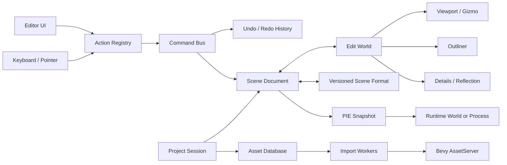

# 基于 Bevy 0.19 的自研引擎路线图

> 状态：规划基线  
> 更新时间：2026-07-30  
> 当前版本：`revy_editor 0.1.0` / `bevy 0.19.0` 基座

## 1. 结论

当前工程已经是一个可交互的编辑器原型，但还不是“引擎编辑器”的骨架。它验证了 Bevy 0.19 的原生 UI、Picking、Transform Gizmo、2D/3D 相机和文件操作能够组合工作，适合继续演进，不需要推倒重写。

下一阶段不能只继续堆面板。必须同时建立三条基础链路：

1. `界面操作 -> EditorAction -> Command -> SceneDocument`，所有编辑行为都能撤销、重做和标记脏状态。
2. `SceneDocument -> EditWorld -> SceneFormat`，场景实体具有稳定 ID，并且能可靠保存、加载和迁移。
3. `Project/AssetDatabase -> Importer -> Bevy AssetServer`，文件浏览不再等同于资产管理。

“对标虚幻 5”应定义为对标它的编辑工作流、扩展能力和生产可靠性，而不是短期重写 Nanite、Lumen、Chaos、Niagara、Blueprint 和完整工具链。建议先做一个对中小型 3D 项目真正可用的垂直引擎，再按项目需求增加高端能力。

## 2. 当前工程评估

### 2.1 已有能力

| 模块 | 当前实现 | 判断 |
| --- | --- | --- |
| 启动与插件 | 单个二进制通过 `EditorPlugin` 聚合 7 个插件 | 可用作启动原型，边界仍然偏弱 |
| UI 壳层 | 顶栏、左右 Dock、底栏、中央视口，使用 Bevy UI + Feathers | 已完成静态布局验证，多数控件尚未连接行为 |
| 面板调整 | 左右宽度和左侧上下比例可拖动 | 可用，但不能停靠、隐藏、恢复或持久化 |
| 视口 | 独立 2D/3D 相机，按 UI 矩形设置 Camera Viewport | 是正确的技术验证 |
| 选择 | 点击 Mesh 或 Hierarchy 行选择单个 `Entity` | 仅适合临时 World，不具备稳定身份和多选 |
| Gizmo | 平移、旋转、缩放，世界/局部空间切换 | 可保留，缺少事务和撤销整合 |
| Hierarchy | 按名称展示当前工作区对象并支持选择 | 实际是扁平列表，不是真正的父子层级 |
| Inspector | 显示 Transform，用加减按钮修改数值 | 是专用演示，不是反射驱动属性编辑器 |
| 文件系统 | 扫描、筛选、拖入复制、创建占位文件、右键菜单 | 功能比 UI 原型更完整，但还不是资产数据库 |
| 2D/3D 工作区 | 切换相机和实体可见性 | 是显示模式切换，不是独立场景文档 |

### 2.2 代码层面的主要问题

1. `editor/src/viewport.rs` 在 Startup 中硬编码演示场景。编辑器启动、场景数据和视口工具没有分层。
2. `Selection(Option<Entity>)` 直接持有瞬时 ECS 实体。保存、重载、复制粘贴和 Play-In-Editor 后无法稳定引用。
3. `editor/src/hierarchy.rs` 仅按名称排序，缓存只比较工作区和对象数量。重命名、重新挂接父节点等变化不能可靠驱动重建。
4. `editor/src/inspector.rs` 只认识 9 个 Transform 字段，每帧同步选中对象，缺少通用属性元数据、验证、连续编辑事务和多选。
5. `editor/src/filesystem.rs` 超过 1,100 行，模型、同步 IO、导入、平台命令和视图混在一起。大目录扫描或复制会阻塞主线程。
6. `editor/src/ui/` 已拆分 UI 壳、主题和控件，但菜单、标签页和工具按钮多数仍只有原型行为。
7. 编辑器 UI 实体、编辑场景实体和未来游戏运行实体都位于同一个 `World`，容易在保存和运行模式下互相污染。
8. 没有场景格式、项目格式、命令栈、撤销重做、脏状态、自动保存、崩溃恢复或版本迁移。
9. 没有单元测试、集成测试、UI 快照、性能基线和 CI 门禁。
10. `bevy_feathers` 仍应视为快速演进的 UI 能力，必须封装在编辑器 UI 层，不能让业务模型依赖具体控件。

### 2.3 当前阶段定义

当前成熟度应定义为 `Prototype 0`：能够演示编辑器外观和最小交互，但不能创建并持久保存一个真实项目。下一目标不是“增加更多假按钮”，而是完成 `Editor MVP`。

## 3. 产品目标与范围

### 3.1 第一目标：Editor MVP

用户可以完成下面的闭环：

1. 创建或打开项目。
2. 创建场景，在 Outliner 中创建、删除、重命名、复制和重设父级。
3. 在 Viewport 中选择对象、导航相机并使用 Gizmo 修改 Transform。
4. 在 Details 面板中编辑注册组件的属性。
5. 全程支持撤销、重做、脏状态和自动保存。
6. 导入 Mesh、Texture、Material 和 Scene 资产，在 Content Browser 中搜索和拖放。
7. 保存、关闭并重新打开项目，场景结果一致。
8. 进入 Play-In-Editor，退出后编辑场景不被运行时修改污染。

### 3.2 中期目标：面向一个具体游戏品类的生产引擎

优先选定一个目标品类，例如单机 3D 动作、模拟经营或战术游戏。围绕该品类完成渲染、物理、动画、音频、脚本、AI、打包和性能分析。不要同时追逐所有游戏类型。

### 3.3 暂不作为早期目标

- 不承诺与 UE5 的资源格式、插件 ABI 或项目格式兼容。
- 不在 Editor MVP 阶段自研脚本语言、物理引擎、建模工具或视频编辑器。
- 不在没有真实内容压力前实现 Nanite/Lumen 等同等级技术。
- 不为了“引擎纯度”重写 Bevy 已经提供并能满足需求的 ECS、渲染、资产和任务系统。

## 4. 目标架构



### 4.1 必须建立的数据边界

#### ProjectSession

负责项目根目录、项目设置、打开的文档、最近文件、编辑器布局和 AssetDatabase。不能把工作目录默认为永久项目模型。

#### SceneDocument

负责场景路径、稳定场景 ID、实体稳定 ID、脏状态、最后保存版本、选择集和文档级命令历史。UI 标签页只观察这个模型。

#### StableEntityId

每个可保存实体使用 UUID 或等价稳定 ID。运行时维护 `StableEntityId <-> Entity` 映射。跨实体引用、Prefab override、撤销重做和复制粘贴都使用稳定 ID。

#### EditorAction

菜单、工具栏、快捷键和上下文菜单都触发同一个 Action，例如 `scene.save`、`edit.undo`、`entity.delete`。Action 持有启用状态、快捷键和展示信息，UI 不直接操作 World。

#### EditorCommand

所有会修改文档的操作必须实现 `apply`、`revert` 和可选 `merge`。Gizmo 拖动和数值拖动从 pointer-down 到 pointer-up 合并成一条命令。

#### PropertyEditorRegistry

基于 Bevy Reflect 构造通用编辑器，并允许为 Transform、Color、Asset Handle、枚举和项目自定义类型注册专用 Drawer。反射负责覆盖面，专用 Drawer 负责体验。

#### AssetDatabase

区分 Source Asset、Imported Artifact 和运行时 Handle。记录资产 ID、源路径、类型、内容哈希、Importer 版本、依赖和导入状态。

### 4.2 编辑态和运行态隔离

MVP 可以采用两个独立 `World`：Editor Host 持有 UI 和编辑状态，Edit World 持有场景内容。PIE 从 SceneDocument 快照生成 Runtime World。

生产阶段推荐将 Standalone Game 和可选 PIE 运行在独立进程中。这样能够隔离崩溃、全局资源、插件初始化、GPU 状态和游戏代码热重载风险。

### 4.3 推荐仓库布局

在 Editor Core 合同稳定后，将单 crate 迁移为 Cargo workspace：

```text
Revy-Bevy/
  apps/
    editor/                 # 桌面编辑器入口
    player/                 # 游戏运行时入口
  crates/
    engine_core/            # 稳定 ID、基础组件、时间、任务等
    engine_render/          # 自定义渲染扩展
    engine_scene/           # 场景格式、序列化、迁移
    engine_asset/           # 资产数据库和 importer
    engine_runtime/         # 游戏运行插件集合
    editor_core/            # 文档、Action、Command、Selection
    editor_ui/              # Feathers/UI 适配和设计系统
    editor_viewport/        # 相机、Picking、Gizmo、overlay
    editor_panels/          # Outliner、Details、Content Browser 等
  build/
    tools/
      asset_worker/         # 可选独立导入进程
    templates/
  examples/
  tests/
  docs/
```

不要立即创建十几个空 crate。先在当前 crate 内按相同边界拆模块；当出现第二个消费者或编译隔离收益时再提取 crate。

## 5. 总体里程碑

时间估算按 1 名全职开发者计算，含基本测试但不含大量美术内容。多人并行时不能简单按人数线性缩短。

| 阶段 | 预计时间 | 主要交付物 | 退出标准 |
| --- | ---: | --- | --- |
| M0 基线固化 | 1-2 周 | 错误处理、日志、测试框架、UI 技术决策 ADR | `fmt/clippy/test/check` 可作为统一门禁 |
| M1 编辑器壳层 | 2-3 周 | 设计系统、Action、菜单、快捷键、可持久布局 | 所有可见命令有真实状态和行为 |
| M2 场景编辑闭环 | 3-4 周 | SceneDocument、稳定 ID、Command、Undo/Redo、保存加载 | 创建场景并无损重开，所有修改可撤销 |
| M3 核心面板 | 3-4 周 | Outliner、反射 Details、多选、搜索、复制粘贴 | 能编辑注册组件，不需要写专用面板 |
| M4 视口工具 | 2-3 周 | 飞行/环绕相机、网格、Gizmo 事务、拖放创建 | Viewport、Outliner、Details 状态一致 |
| M5 内容浏览器 | 3-4 周 | AssetDatabase、异步导入、缩略图、文件监听 | 大目录不阻塞 UI，资产可追踪和重导入 |
| M6 PIE 与打包 | 3-4 周 | Edit/Play 隔离、运行控制、项目构建配置 | 退出 PIE 后编辑态不变，可打包最小游戏 |
| M7 垂直游戏能力 | 4-9 个月 | 物理、动画、音频、脚本/游戏逻辑、AI、Profiler | 能完整制作选定品类的小型游戏 |
| M8 生产强化 | 9-24+ 个月 | 大世界、协作、网络、渲染升级、插件 SDK | 由真实项目指标决定，不按功能清单盲目扩张 |

Editor MVP 的详细任务见 [EDITOR_MVP_PLAN.md](./EDITOR_MVP_PLAN.md)。

## 6. UE5 能力对标矩阵

| 领域 | 第一阶段目标 | 中期目标 | 高阶目标 |
| --- | --- | --- | --- |
| 编辑器框架 | Dock、Action、布局、主题、多文档 | 多窗口、插件面板、工作区预设 | 团队角色和可定制工作流 |
| 场景 | 层级、组件、保存加载、Prefab 基础 | Subscene、引用修复、版本迁移 | World Partition、多人协作 |
| 属性编辑 | Reflect Drawer、验证、多选 | 自定义详情面板、条件属性 | 可视化对象差异和批处理 |
| 视口 | 相机导航、Picking、Gizmo、overlay | 多视口、正交视图、测量工具 | 大场景流送和高级可视化 |
| 资产 | 数据库、导入、重导入、缩略图 | 依赖图、派生数据缓存、Cook | 分布式缓存和构建农场 |
| 渲染 | 使用 Bevy PBR，加入项目所需扩展 | 阴影、后处理、材质工具、GPU profiling | 虚拟几何/全局光照只按需求研究 |
| 物理 | 接入成熟 Rust 物理库 | 编辑器碰撞工具、调试绘制 | 大规模破坏和车辆等按项目扩展 |
| 动画 | Bevy Animation + 状态机工具 | 动画图、Retarget、IK | Control Rig 等高级工具 |
| 脚本 | Rust 游戏 crate + 热重启流程 | Lua/WASM 或节点逻辑二选一 | 调试器、性能分析和稳定扩展 API |
| VFX | 粒子插件或受控自研 GPU 粒子 | 节点式发射与曲线编辑 | Niagara 级系统属于独立长期项目 |
| 音频 | 播放、Bus、空间音频 | 混音面板、事件和调试 | 专业音频中间件级工作流 |
| AI | NavMesh、行为状态机、调试显示 | 行为树/Utility AI 工具 | 大规模人群和 EQS 类工具 |
| 网络 | 明确游戏需求后接入 | Replication、预测、回滚 | 大型在线服务不属于通用编辑器 MVP |
| 发布 | Player、配置、资源 Cook | 平台 profile、增量构建 | 主机平台认证和分布式发布 |

## 7. 技术决策顺序

下面四个决策必须在 M0-M2 形成 ADR，避免后续反复重写：

1. **ADR-001 UI 技术栈**：MVP 建议继续 Bevy UI + Feathers，保留现有成果；同时把 Widget 和业务模型隔离。如果关键控件或虚拟列表无法达到指标，再整体切换到兼容 Bevy 0.19 的成熟桌面 UI 方案，不能长期混用两套交互模型。
2. **ADR-002 场景格式**：建议使用带 `format_version` 的项目自有 envelope，内部可利用 Reflect/DynamicScene，但文件格式和迁移责任由引擎掌握。
3. **ADR-003 Edit/PIE 隔离**：MVP 双 World，生产阶段允许独立进程。
4. **ADR-004 游戏逻辑扩展**：先用 Rust crate 和重启式迭代；只有真实项目证明需要时再选 Lua、WASM 或可视化脚本。

依赖引入原则：先确认 Bevy 0.19 兼容性、维护状态、许可证、WASM/桌面支持和序列化边界，再锁定精确版本。物理、导航、粒子、脚本和 UI Dock 不应凭印象选库。

## 8. 工程质量门禁

### 每次提交

- `cargo fmt --check`
- `cargo check --workspace --all-targets`
- `cargo clippy --workspace --all-targets -- -D warnings`
- `cargo test --workspace`

### 每个里程碑

- 场景保存加载 round-trip 测试。
- Command apply/revert/merge 测试。
- 常用分辨率和 DPI 的 UI 截图回归。
- 1,000/10,000 实体 Outliner 和 10,000 资产 Content Browser 基准。
- 损坏项目文件、缺失资产、循环父子关系、导入失败等故障测试。
- Windows 为第一支持平台；跨平台能力进入 CI 后才对外声明支持。

### 目标指标

| 指标 | Editor MVP 目标 |
| --- | --- |
| 空项目启动 | 开发机上 3 秒内进入可交互状态，首次 GPU 初始化另行记录 |
| UI 响应 | 普通编辑操作在下一帧反馈，耗时 IO 不占主线程 |
| Undo/Redo | 100+ 连续命令可往返，结果与初始/最终快照一致 |
| 场景可靠性 | 保存后重开等价，未知组件给出错误而不是静默丢失 |
| 崩溃恢复 | 修改后最多丢失一个自动保存间隔 |
| 布局 | 1280x720、1920x1080、4K/高 DPI 下无不可达控件和重叠 |

## 9. 风险与控制

| 风险 | 影响 | 控制措施 |
| --- | --- | --- |
| Feathers API 演进 | UI 大范围改动 | 只在 `editor_ui` 内使用，建立 Widget facade 和 ADR 检查点 |
| Bevy 0.19 基座长期分叉 | 底层修复和平台兼容由团队负责 | 将 0.19 作为继承基线独立演进；不跟随 0.20，仅按需移植安全和驱动修复 |
| 过早追求 UE5 渲染特性 | 编辑器长期不可用 | 用垂直游戏需求驱动渲染能力，先完成生产闭环 |
| 单 World 污染 | PIE 和保存不可预测 | M2 前完成 EditWorld/RuntimeWorld 边界 |
| 反射序列化失控 | 文件不兼容或数据丢失 | 类型白名单、版本号、迁移测试、未知类型显式报错 |
| 同步文件 IO | 大项目卡顿 | Asset worker、任务队列、增量 watcher、可取消任务 |
| 插件无边界 | crate 循环依赖 | 核心合同放在 `editor_core`，面板只通过 Action/Query API 协作 |
| 范围失控 | 永远没有可发布版本 | 每阶段必须能做出一个真实内容；未进入目标项目的功能不排期 |

## 10. 人力与现实预期

- 1 名全职开发者：Editor MVP 约 4-6 个月；针对单一游戏品类的可用引擎约 12-24 个月；生产强化通常需要 24-36 个月以上。
- 3-5 人小队：可并行编辑器、资产和运行时，但仍需要至少一个完整项目验证 12-24 个月。
- UE5 的广度是大型团队多年积累。合理目标是“在目标游戏品类上达到相近的核心制作体验”，不是全功能等价。

## 11. 文档体系

建议随实现维护下面的文档，不允许文档只描述不存在的功能：

```text
docs/
  ENGINE_ROADMAP.md         # 本文：方向、边界、阶段
  EDITOR_MVP_PLAN.md        # 编辑器优先实施规格
  architecture/
    editor-worlds.md
    scene-format.md
    asset-pipeline.md
  adr/
    0001-ui-stack.md
    0002-scene-format.md
    0003-edit-pie-isolation.md
    0004-game-logic-extension.md
  formats/
    project-format.md
    scene-format.md
    asset-metadata.md
  testing/
    editor-test-matrix.md
```

每个里程碑结束时同时更新：已交付能力、未完成项、格式版本、兼容范围、性能数据和已知限制。
